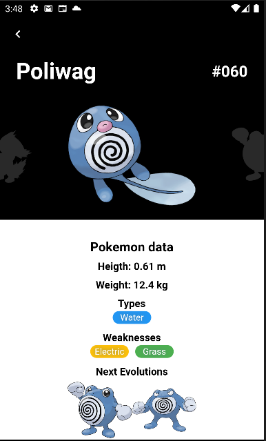

# Pokedex Getx

Projeto utilizando [Flutter](https://flutter.dev/), com o objetivo de mostrar uma requisição em API REST para listagem de Pokemons.

O objetivo desse projeto foi testar meus conhecimentos com Flutter, Getx e Consumo de API's REST.

## Funcionalidades

1. Listagem de Pokemons após chamada GET neste [endpoint](https://raw.githubusercontent.com/Biuni/PokemonGO-Pokedex/master/pokedex.json).
2. Utilização do [Getx](https://pub.dev/packages/get) como gerenciador de estado e rotas.
3. Mudança do tema de cores do aplicativo de acordo com o desejo do usuário.
4. Filtragem da lista de pokemons de acordo com o nome.
5. Tela de detalhes do Pokemon selecionado.

## Dependências do projeto

* [get](https://pub.dev/packages/get)
* [dio](https://pub.dev/packages/dio)
* [freezed](https://pub.dev/packages/freezed)
* [freezed_annotation](https://pub.dev/packages/freezed_annotation)
* [cached_network_image](https://pub.dev/packages/cached_network_image)
* [flutter_switch](https://pub.dev/packages/flutter_switch)
* [get_storage](https://pub.dev/packages/get_storage)
* [json_serializable](https://pub.dev/packages/json_serializable)
* [build_runner](https://pub.dev/packages/build_runner)

## Como executar o projeto

Para execução desse projeto tenha em sua máquina o Flutter instalado. O guia de instalação pode ser acessado neste [link](https://docs.flutter.dev/get-started/install).

Após instalar e clonar o projeto, e ter um emulador Android ou IOs em execução; abra o terminal no diretório do projeto e execute os seguintes comandos:

```bash
flutter pub get
```

```bash
flutter run
```

Em caso de problemas execute:

```bash
flutter clean
```

```bash
flutter pub upgrade
```

e em seguida repita os comandos anteriores.

## Capturas de Tela

1. Tela inicial do App:


2. Tela inical do App com tema escuro:


3. Tela incial do App, buscado pela Pokemon utilizando a chave 'Poli': 


4. Tela de detalhes


5. Tela de detalhes com tema escuro

